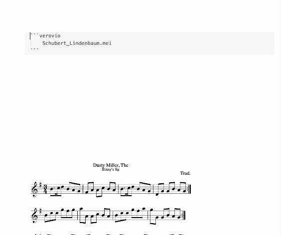

# Verovio Music Renderer for Obsidian


This is a plugin for [Obsidian](https://obsidian.md) that uses [Verovio](https://www.verovio.org/) – a lightweight open-source library for engraving Music Encoding Initiative (MEI) music scores (as well as ABC and MusicXML files) into SVG. With this plugin, you can render musical scores seamlessly within Obsidian, enhancing your efficiency when working with written music.

The plugin currently has the following features:
- Rendering MEI, ABC, and MusicXML notation dynamically from files in the Obsidian folder (relative paths) and URLs (absolute paths).
- A download button for the rendered SVG file (the toolbar is visible when hovering the mouse over the rendered music).
- A settings menu to adjust various rendering options.
- Sound playback of the rendered music.
- Highlighting of live playback notes, synced to the sound playback (syncing is still not fully reliable, though).
- Opening the rendered file via an external editor (if you want to edit your files outside of Obsidian).
- Rendering specific measure selections.

### Future Features (Help Wanted):
- The ability to render not just from URLs but also direct code, similar to the [ABCJS plugin](https://github.com/abcjs-music/obsidian-plugin-abcjs).
- Humdrum support.
- Page turning.
- Bugfixing (especially highlighting timing).

## How to Use
Install the plugin, then copy the following into your Obsidian document:

```
COPY FROM HERE
```verovio
https://www.verovio.org/examples/downloads/Schubert_Lindenbaum.mei
```COPY UNTIL HERE

```

or just use a filename from a file in your Obsidian Vault like this:

```
COPY FROM HERE
```verovio
Schubert_Lindenbaum.mei
```COPY UNTIL HERE

```

## Rendering Options
In the settings menu of the Obsidian plugin, you can adjust several important parameters globally for all renderings. 
You can also apply custom settings for a specific rendering by adding them to your code block in Obsidian. Please refer to the [Verovio documentation](https://book.verovio.org/toolkit-reference/toolkit-options.html) for available options. Note that not all options may work and that they interfere with each other.

```
COPY FROM HERE
```verovio
Schubert_Lindenbaum.mei
font: Leland
scale: 10
breaks: encoded
```COPY UNTIL HERE

```

## Rendering Measure Selections
A special feature of this plugin is rendering predefined measures. To render measures 1-10, you can use the measureRange command like in this example. Please note that in this example, measure 20 is not included in the rendering. The type of breaks you choose to render can greatly influence the output (or even make the plugin render nothing at all). For example, "encoded" breaks can result in a blank rendering if no encoded break exists in your selection. Because of this, "breaks: none" is added to the example below, which might be a good default option for rendering musical snippets. You can also use "start" and "end" instead of numbers, e.g. `measureRange: 15-end` – or just render single measures: `measureRange: 5`


```
COPY FROM HERE
```verovio
Schubert_Lindenbaum.mei
scale: 50
breaks: none
measureRange: 1-20
```COPY UNTIL HERE

```

## Manually Installing the Plugin

- Copy main.js, styles.css, and manifest.json from the release (look right) to your vault into a folder like this: VaultFolder/.obsidian/plugins/Verovio-Music-Renderer/.

## If You Are Cloning This Project, Read This:
- Audio playback requires changing the _root2.default.soundfontUrl = in /node_modules/lz-midi/lib/midi.js to the following (or a different) URL like this: _root2.default.soundfontUrl = 'https://paulrosen.github.io/midi-js-soundfonts/FluidR3_GM/';. I am using [Paul Rosens midi-js-soundfonts](https://github.com/paulrosen/midi-js-soundfonts)


## Additionally Used (With Many Thanks):
- [Verovio](https://github.com/rism-digital/verovio) – please support [RISM](https://rism.digital/) and their amazing work
- [lz-midi](https://github.com/AAlittleWhite/lz-midi)

I have just rudimentary programming skills and use mostly ChatGPT.
