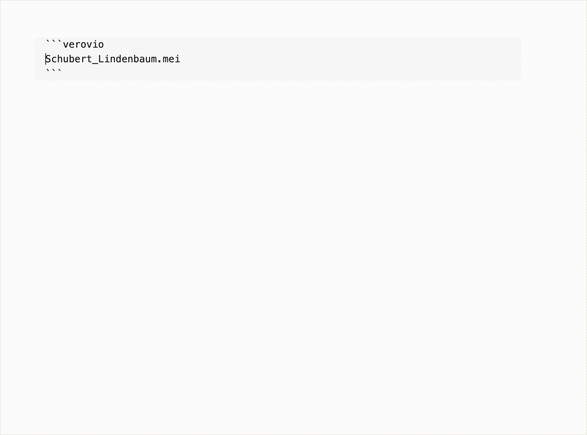
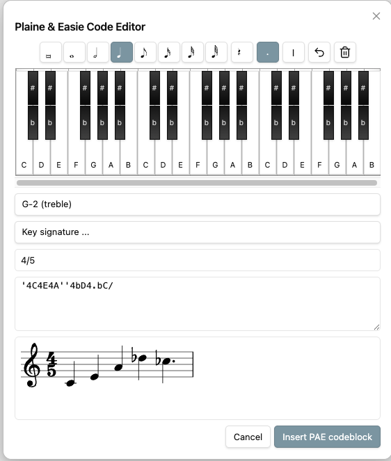
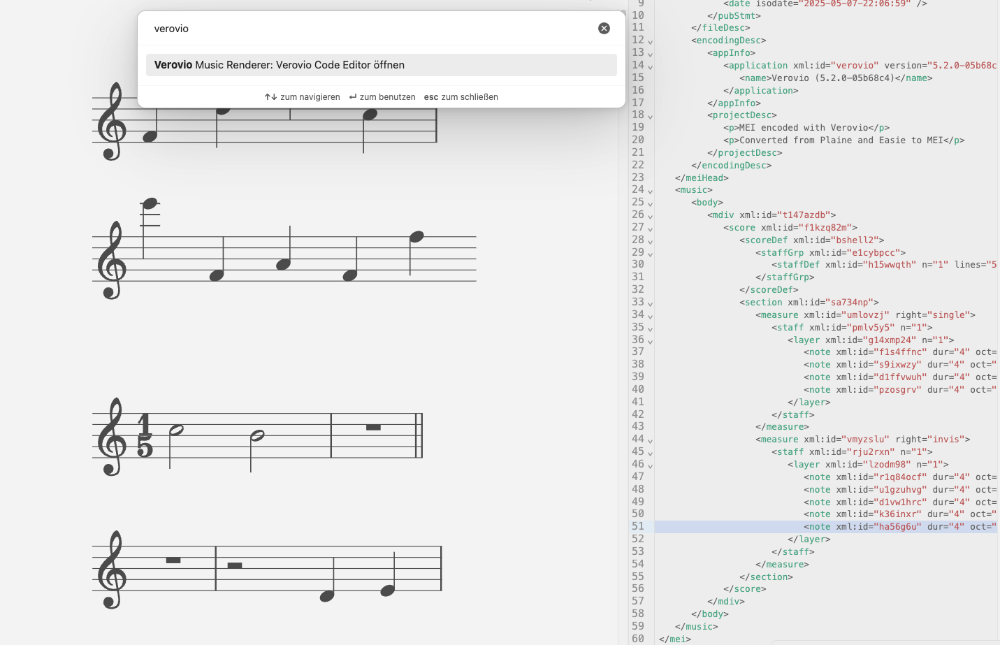

# Verovio Music Renderer for Obsidian



This is a plugin for [Obsidian](https://obsidian.md) that uses [Verovio](https://www.verovio.org/) – a lightweight open-source library for engraving Music Encoding Initiative (MEI) music scores (as well as ABC, GABC, MusicXML and PAE files) into SVG. With this plugin, you can render musical scores seamlessly within Obsidian, edit them and play them back, enhancing your efficiency when working with written music.

The plugin currently has the following features:
- Rendering MEI, ABC, GABC, MusicXML, PAE notation dynamically from files in the Obsidian folder (relative paths) and URLs (absolute paths) and also directly from code blocks.
- Converting selected ABC, GABC, MusicXML, or PAE code to MEI via the Obsidian Command Palette.
- A side panel where you can edit your musical code (with syntax highlighting for XML and MEI). You can click on a rendered note and it will jump to the right line of code. (Only works for MEI code directly from the code block, not for linked files.)
- A download button for the rendered SVG file (the toolbar is visible when hovering the mouse over the rendered music).
- A settings menu to adjust various rendering options (including an automatic dark mode and highlight color).
- Sound playback of the rendered music.
- Highlighting of live playback notes, synced to the sound playback.
- Opening the rendered file via an external editor (if you want to edit your files with one click).
- Rendering specific measure selections.
- Page turning buttons and automatic page turning during playback


## How to Use
Install the plugin, then copy the following into your Obsidian document:

```
COPY FROM HERE
```verovio
https://www.verovio.org/examples/downloads/Schubert_Lindenbaum.mei
```COPY UNTIL HERE

```

or just use a filename from a file in your Obsidian Vault like this:

```
COPY FROM HERE
```verovio
Schubert_Lindenbaum.mei
```COPY UNTIL HERE

```

you can also render directly from the Obsidian Code Block:

it works with MusicXML

```
COPY FROM HERE
```verovio
<mei xmlns="http://www.music-encoding.org/ns/mei">
  <music>
    <body>
      <mdiv>
        <score>
          <section>
            <measure n="1">
              <staff n="1">
                <layer n="1">
                  <note pname="c" oct="4" dur="4"/>
                  <note pname="e" oct="4" dur="4"/>
                  <note pname="g" oct="4" dur="4"/>
                </layer>
              </staff>
            </measure>
          </section>
        </score>
      </mdiv>
    </body>
  </music>
</mei>
```COPY UNTIL HERE
```

also with ABC Notation 

```
COPY FROM HERE
```verovio
X:1
T: Test-Melody
M:4/4
K:C
C D | G A B c |
```COPY UNTIL HERE
```

and of course MEI

```
COPY FROM HERE
```verovio
<?xml version="1.0" encoding="UTF-8"?>
<?xml-model href="https://music-encoding.org/schema/5.0/mei-all.rng" type="application/xml" schematypens="http://relaxng.org/ns/structure/1.0"?>
<?xml-model href="https://music-encoding.org/schema/5.0/mei-all.rng" type="application/xml" schematypens="http://purl.oclc.org/dsdl/schematron"?>
<mei xmlns="http://www.music-encoding.org/ns/mei" meiversion="5.0">
   <meiHead>
      <fileDesc>
         <titleStmt>
            <title />
         </titleStmt>
         <pubStmt>
            <date isodate="2026-05-23-13:23:13" />
         </pubStmt>
      </fileDesc>
      <encodingDesc>
         <appInfo>
            <application xml:id="verovio" version="4.5.1-deb523f">
               <name>Verovio (4.5.1-deb523f)</name>
            </application>
         </appInfo>
         <projectDesc>
            <p>MEI encoded with Verovio</p>
            <p>Converted from Plaine and Easie to MEI</p>
         </projectDesc>
      </encodingDesc>
   </meiHead>
   <music>
      <body>
         <mdiv xml:id="m1fuif7x">
            <score xml:id="s59t00i">
               <scoreDef xml:id="sax54by" meter.count="4" meter.unit="4">
                  <keySig xml:id="kk0w9z9" sig="1s" />
                  <staffGrp xml:id="sr0v46p">
                     <staffDef xml:id="s1sv0eza" n="1" lines="5" clef.shape="G" clef.line="2" />
                  </staffGrp>
               </scoreDef>
               <section xml:id="shkhrm9">
                  <measure xml:id="m119wlyw" right="single">
                     <staff xml:id="s1w12kwo" n="1">
                        <layer xml:id="lu2c8co" n="1">
                           <note xml:id="npm6i1o" dur="4" oct="4" pname="c" />
                           <note xml:id="n1e4uqs9" dur="4" oct="4" pname="g" />
                           <note xml:id="n1mfvt3g" dur="4" oct="5" pname="d" />
                           <note xml:id="n1u9m2av" dur="4" oct="4" pname="e" />
                        </layer>
                     </staff>
                  </measure>
               </section>
            </score>
         </mdiv>
      </body>
   </music>
</mei>
```COPY UNTIL HERE
```
and also PAE
```
COPY FROM HERE
```verovio
@clef:G-2
@keysig:
@timesig:c
@data:2''C'B/=/''CC/=/2-4DE/2-8{'B''C+C'B}/2''C-//
```COPY UNTIL HERE
```

and also GABC / Gregorian chant notation

```
COPY FROM HERE
```verovio
supertitle:;
title: Alleluia
subtitle: Mode VI
text-left:;
text-right:;
annotation:VI;
%%
(c4) Al(f)le(g)lu(h)ia,(f) (,) al(gh)le(g)lu(f)ia,(d.c.) (,) al(f)le(gh)lu(gf)ia(f.) (::)
```COPY UNTIL HERE
```

or from a GABC file in your vault

```
COPY FROM HERE
```verovio
al--adducentur--vatican.gabc
```COPY UNTIL HERE
```

## Plaine & Easie Editor
You can open a Plaine & Easie editor from the Obsidian Command Palette with the command "Insert Plaine & Easie music codeblock". It provides a notation-oriented input modal with note values, rests, clefs, key signatures, a small piano keyboard, live Verovio preview, and inserts the result as a compact PAE code block.



## Side Panel
You can open a side panel via the Obsidian Command Palette to edit your musical code directly, complete with XML and MEI syntax highlighting. Clicking on a rendered note will jump you to the corresponding line of code—but this only works for MEI inside a code block, not for externally linked files.



## Rendering Options
In the settings menu of the Obsidian plugin, you can adjust several important parameters globally for all renderings, including a dark mode and picking a highlight color.
You can also apply custom settings for a specific rendering by adding them to your code block in Obsidian. Please refer to the [Verovio documentation](https://book.verovio.org/toolkit-reference/toolkit-options.html) for available options. Note that not all options may work and that they interfere with each other. Please note, these won't work (yet), when you're rendering from a code block.

```
COPY FROM HERE
```verovio
Schubert_Lindenbaum.mei
font: Leland
scale: 10
breaks: encoded
```COPY UNTIL HERE

```

## Rendering Measure Selections
A special feature of this plugin is rendering predefined measures. To render measures 1-10, you can use the measureRange command like in this example. Please note that in this example, measure 20 is not included in the rendering. The type of breaks you choose to render can greatly influence the output (or even make the plugin render nothing at all). For example, "encoded" breaks can result in a blank rendering if no encoded break exists in your selection. Because of this, "breaks: none" is added to the example below, which might be a good default option for rendering musical snippets. You can also use "start" and "end" instead of numbers, e.g. `measureRange: 15-end` – or just render single measures: `measureRange: 5`


```
COPY FROM HERE
```verovio
Schubert_Lindenbaum.mei
scale: 50
breaks: none
measureRange: 1-20
```COPY UNTIL HERE

```

## Installing the Plugin
This plugin is part of the Obsidian community plugins. You can also install it via [BRAT](https://github.com/TfTHacker/obsidian42-brat) (just add the URL you're on right now as a beta plugin).
You can also do it manually: Copy the files main.js and manifest.json from the release (look right) into the plugin folder of your vault like this: VaultFolder/.obsidian/plugins/Verovio-Music-Renderer/.

## If you are forking this project, read this:
- Audio playback uses [Paul Rosen's midi-js-soundfonts](https://github.com/paulrosen/midi-js-soundfonts). The SoundFont URL is patched automatically during the build in `esbuild.config.mjs`, so you do not need to edit `node_modules/lz-midi/lib/midi.js` by hand.
- The noisy MIDI-file logging in `lz-midi` is disabled automatically during the build in `esbuild.config.mjs`, so it does not fill the Obsidian developer console.


## Privacy & Network Activity

This plugin respects your privacy:

- **Network requests are on-demand only**: The plugin only makes network requests when you explicitly provide external URLs (e.g., `https://example.com/file.mei`) in code blocks. No background data transmission, automatic polling, or telemetry occurs.
- **Playback downloads SoundFonts on demand**: When you press the playback button, `lz-midi` may download instrument SoundFont files from `https://paulrosen.github.io/midi-js-soundfonts/FluidR3_GM/` so the rendered score can be played. This is triggered by the user's playback action and is not telemetry.
- **No tracking or analytics**: The plugin does not collect any usage data, telemetry, or user information.
- **Local-first by default**: Music files stored in your Obsidian vault are processed locally without any network access.
- **Transparent external requests**: When you reference an external URL in a code block, the plugin fetches that specific resource on-demand only when you render the code block. When you use playback, the plugin may fetch only the SoundFont assets needed for audio output.

## Additionally Used (With Many Thanks):
- [Verovio](https://github.com/rism-digital/verovio) – please support [RISM](https://rism.digital/) and their amazing work
- [lz-midi](https://github.com/AAlittleWhite/lz-midi)

I have just rudimentary programming skills, so this plugin is mostly vibe coded.

## FAQ

Q: Is it working with the mobile versions of Obsidian?
A: Yes, but the buttons for download and opening externally don't work.

Q: The "folder" icon doesn't open anything.
A: You need to define a default application for that file type to open it in your operating system.

Q: When I use "measureRange," it just renders a blank box.
A: Try changing the breaks type in the plugin options.

Q: I don't hear anything, and playback isn't starting.
A: Make sure you're connected to the internet to load the SoundFont for playback. It won't work offline, and note highlighting won't either. Check the Obsidian dev tools when in doubt.

Q: I don't hear anything on iOS.
A: Make sure Silence Mode is not turned on; otherwise you won't hear anything, even with full volume.

## Disclaimer

I vibecode my plugins—and the scope of this work exceeds my programming skills. Because of this, there is always a residual risk when using them. I do this primarily to bridge certain gaps in my own workflow. Should these plugins ever become obsolete because a professional developer used them as inspiration to code something truly solid and sophisticated, I would be absolutely thrilled.
