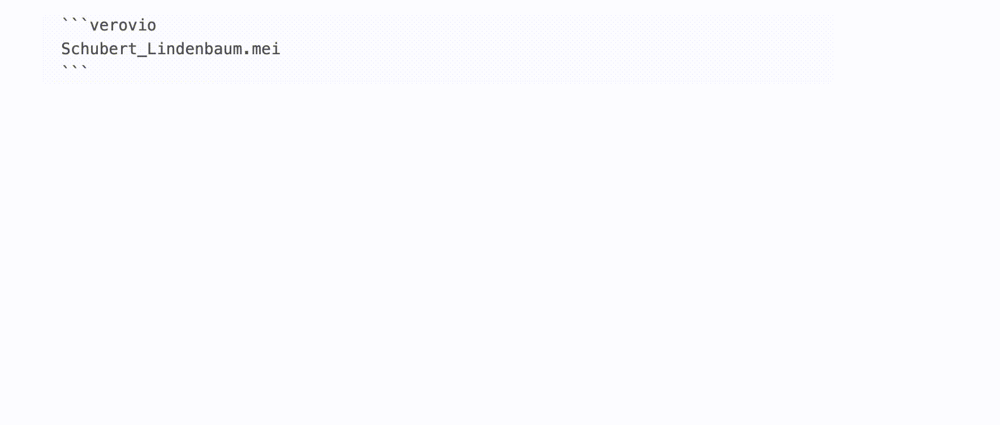

# Verovio Music Renderer for Obsidian



This is a plugin for [Obsidian](https://obsidian.md) that uses [Verovio](https://www.verovio.org/) – a lightweight open-source library for engraving Music Encoding Initiative (MEI) music scores (and also ABC and MusicXML files) into SVG. With this plugin you can render musical scores seamlessly within Obsidian and thus use it more efficiently when working with written music.

The plugin already has the following features:
- rendering MEI, ABC and MusicXML notation dynamically from the Obsidian folder (relative) and URLs (absolute)
- download button for the rendered SVG-File (Toolbar visible by hovering the mouse over the renderd music)
- a settings menu to change the rendering options
- Sound playback of the rendered music
- highlighting of the live playback notes, synced to the sound playback (still not reliably synced, though)
- opening the rendered file via an external editor (if you want to exit your files outside of obsidian)

And I would love to implement these as well (and would love some help):
- the possibility to just render a selection of bars (as stated here https://book.verovio.org/interactive-notation/content-selection.html)
- the possibility to render not just URLs but also direct code like the ABCJS plugin https://github.com/abcjs-music/obsidian-plugin-abcjs
- wide humdrum support

## How to use

Install the plugin. Then copy this into your Obsidian document

```
COPY FROM HERE
```verovio
https://www.verovio.org/examples/downloads/Schubert_Lindenbaum.mei
```COPY UNTIL HERE

```

or just use a filename from a file in your Obsidian Vault like this:

```
COPY FROM HERE
```verovio
Schubert_Lindenbaum.mei
```COPY UNTIL HERE

```

## Manually installing the plugin

- Copy over `main.js`, `styles.css`, `manifest.json` from the release (look right) to your vault into a folder like this `VaultFolder/.obsidian/plugins/Verovio-Music-Renderer/`.

## If you are cloning this project,read this:
- Audio playback requires changing the Soundfont path in /node_modules/lz-midi/lib/midi.js to the following (Starting from line 131):
	`_root2.default.soundfontUrl = 'https://paulrosen.github.io/midi-js-soundfonts/FluidR3_GM/';`


## Additionaly used (with many thanks)
- [Verovio](https://github.com/rism-digital/verovio) – please support [RISM](https://rism.digital/) and their amazing work
- [lz-midi](https://github.com/AAlittleWhite/lz-midi)

I have just rudimentary programming skills and use mostly ChatGPT.
